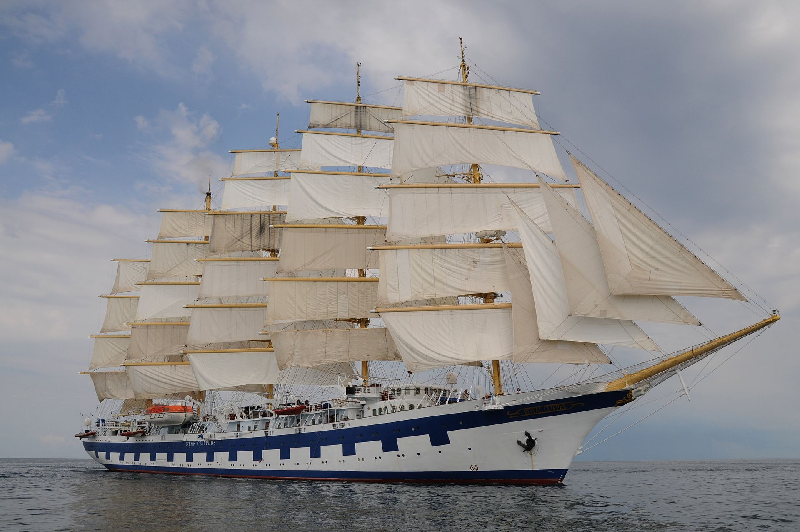
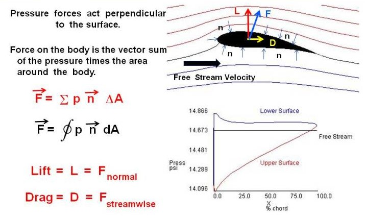

# Opis Wycinka Rzeczywistości

## Żaglowiec

[Żaglowiec](https://pl.wikipedia.org/wiki/%C5%BBaglowiec) (statek żaglowy) – statek wodny o napędzie żaglowym. Jednostka pływająca, której jedynym lub podstawowym czynnikiem napędowym jest jeden lub więcej żagli. Na danej jednostce przygotowanej do żeglugi zbiór wszystkich możliwych do zastosowania na niej rodzajów żagli stanowi jej aktualne ożaglowanie, przy czym nie wszystkie rodzaje tych żagli muszą być użyte jednocześnie.



pełnorejowiec Royal Clipper

Głównymi elementami umożliwiającymi poruszanie się statku są [żagiel](#żagiel)(oddziaływający z powietrzem) i miecz(oddziaływający z wodą).
Zasada działania żagla i miecza jest niemal identyczna, a w mojej symulacji będzie dokładnie taka sama.

Przyjrzyjmy się zatem bliżej jednemu z nich np [żaglowi](#żagiel).

## Żagiel
[Żagiel](https://pl.wikipedia.org/wiki/%C5%BBagiel) – rodzaj pędnika wiatrowego stosowanego do napędzania żaglowców, jachtów, bojerów, żaglowozów itd. Jest to odpowiednio ukształtowany płat tkaniny (ew. innego tworzywa) rozpięty na omasztowaniu jednostek żaglowych, stawiany fałami i kierowany szotami lub brasami (najczęściej przy użyciu lin pomocniczych). Zadaniem żagla jest wytworzenie [siły aerodynamicznej](#siła-aerodynamiczna) napędzającej jednostkę. Zespół żagli tworzy ożaglowanie.

Przyjrzyjmy się temu co najważniejsze w żaglu, czyli sile aerodynamicznej 
## Siła Aerodynamiczna

[Siła aerodynamiczna](https://pl.wikipedia.org/wiki/Si%C5%82a_aerodynamiczna) – siła wywierana na ciało przez powietrze lub inny gaz, w którym ciało jest zanurzone, będąca wynikiem ruchu ciała względem gazu. Siła wynika z dwóch przyczyn:
+ [siły parcia](https://pl.wikipedia.org/wiki/Parcie_hydrostatyczne) wywołanej ciśnieniem wywieranym na powierzchnię ciała,
+ [siły lepkości](https://pl.wikipedia.org/wiki/Lepko%C5%9B%C4%87), wynikającej z tarcia wewnętrznego w płynie w pobliżu poruszającego się ciała.

Siła parcia działa miejscowo prostopadle do powierzchni ciała, siła lepkości działa miejscowo równolegle (ścinająco) do powierzchni. Całkowita siła aerodynamiczna działająca na ciało jest wektorową sumą tych dwóch sił scałkowaną po całej powierzchni ciała.


+
+
+


Wyznaczanie dokładnych ciśnień i prędkości poruszającego się gazu to skomplikowany proces. Dlatego dla wyznaczenia siły aerodynamicznej działającej na żagiel posłużę się pewnymi uproszczeniami.

## Siła aerodynamiczna w żeglarstwie

Dążąc do określenia siły działającej na żagiel rozpatruje się następujące czynniki: 
+ **Prędkość wiatru pozornego** - czyli prędkość wiatru względem żagla. Wartość siły aerodynamicznej jest wprost proporcjonalna do kwadratu prędkości wiatru pozornego. Dwukrotny wzrost prędkości wiatru oznacza wytworzenie czterokrotnie większej siły aerodynamicznej. 
+ **Powierzchnia ożaglowania** - siła aerodynamiczna jest wprost proporcjonalna do powierzchni ożaglowania. 
+ **Własności aerodynamiczne ożaglowania** - siła aerodynamiczna wytworzona na żaglach w znaczny sposób zależy od typu ożaglowania oraz cech konstrukcyjnych żagli takich jak: wybrzuszenie, smukłość, czy nawet rodzaj materiału. 
+ **Kąt natarcia** – kąt pomiędzy kierunkiem przepływu wiatru a cięciwą żagla. Dla kursów ostrych, do prawidłowej pracy żagla, kąt natarcia powinien mieć od 10° do 20°. Dla kursów pełnych kąt natarcia jest bliski kątowi prostemu.


*Schematycznie przedstawiona siła aerodynamiczna Fae powstająca na żaglu jachtu oraz jej składowe: siła ciągu Fc i siła przechylająca Fp*

Wartość siły aerodynamicznej zależy od prędkości ruchu ciała, w przybliżeniu jest proporcjonalna do kwadratu prędkości. Zależy od powierzchni ciała, jej wielkości, kształtu, ustawienia względem kierunku ruchu w gazie, dla danego kształtu i jego ustawienia w przybliżeniu jest proporcjonalna do powierzchni ciała. Jest proporcjonalna do gęstości gazu, która zależy od rodzaju gazu, jego temperatury i ciśnienia. Dla powietrza stosuje się przybliżony wzór:
```
Fae = q · S · C = 0,0626 · V^2 · S · C 
```
gdzie: 
+ **q** - ciśnienie dynamiczne, 
+ **V** - prędkość ciała względem gazu, 
+ **S** - powierzchnia ciała, 
+ **C** - współczynnik siły aerodynamicznej.