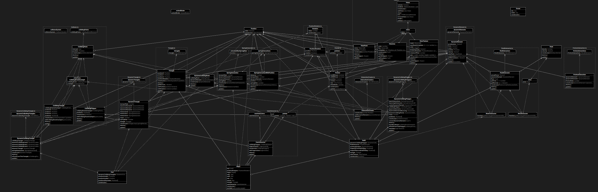

# Elementy świata

## świat

`Elementy świata` posiadają referencje do innych elementów świata. Tworzą w ten sposób strukturę danych (świat).
Tak wygląda diagram klas Elementów świata:


### Wybrane Elementy świata

#### Position
```ts
export class Position {
    value: Vector2 = new Vector2(0, 0);
    constructor(value: Vector2 = new Vector2(0, 0)) {
    this.value = value;
    }
}
```
Pozycja jest tylko daną, nie posiada metod.

#### DynamicElement
```ts
export class DynamicElement {
    force = new Vector2(0, 0);
    mass = 1;
    acceleration = new Vector2(0, 0);
    velocity = new Vector2(0, 0);
    position: Position

    viewPoint: ViewPoint // na potrzeby testów

    constructor(position: Position, mass: number = 1) {
        this.mass = mass;
        this.position = position;

        this.viewPoint = new ViewPoint(position);

        dynamicElements.addElement(this);
    }

    update(dt: number) {
        this.acceleration = this.force.clone().divideScalar(this.mass);
        this.velocity.add(this.acceleration.clone().multiplyScalar(dt));
        this.position.value.add(this.velocity.clone().multiplyScalar(dt));

        this.force = new Vector2(0, 0);
    }

    remove() {
        dynamicElements.removeElement(this);
    }

    getMomentum() {
        return this.velocity.clone().multiplyScalar(this.mass);
    }
}
```

Jest to jeden z ważniejszych elementów świata. Przechowuje on informacje o prędkości, przyspieszeniu, masie, pędzie i sile, która działa na element. metoda `update` dokonuje [integracji numerycznej](https://en.wikipedia.org/wiki/Numerical_integration#Reasons_for_numerical_integration) [równań ruchu](https://en.wikipedia.org/wiki/Equations_of_motion) W ten sposób oblicza nowe wartości swoich atrybutów. Ten Obiekt nie implementuje `WorldElements` ponieważ korzysta ze zmodyfikowanej metody `update` która przyjmuje argument `dt` (delta time) czyli zmiana jaka będzie użyta w integracji.
Należy uważać na prawidłową wartość `dt`. Zbyt mała może spowodować problemy z wydajnością, a zbyt duża może spowodować destabilizacje modelu dynamicznego tzn. model przestanie zachowywać stałe ruchu takie jak: zachowanie pędu, czy energii w skutek czego model się 'rozpadnie'.

##### Stabilność modelu dynamiki

Model jest stabilny, jeżeli zachowuje pęd

Pęd jest stały, jeżeli `dt` jest dostatecznie małe. Istnieje takie `dtMax` poniżej, którego system jest stabilny.  Jak podaje Wikipedia `dtMax` jest związane z największą częstością drgania któregokolwiek molekuła systemu. [Energy Drift](https://en.wikipedia.org/wiki/Energy_drift)

```
dtMax = 2^(1/2)/omega
```


Omega jest stała, jeżeli oddziaływania się nie zmieniają, to znaczy nie powstają i nie znikają nowe obiekty klasy `Interaction`. Omega jest równa 
```
omega = (k/m)^(1/2)
```
gdzie:
+ `k` - współczynnik sprężystości
+ `m` - masa

Dla cząstek, które podlegają wielu oddziaływaniom, zsumuję współczynnik sprężystości, tak jak by sprężyny były połączone równolegle.

Teraz znajduję największą omegę i na jej podstawie wyznaczam `dtMax` poniżej której system jest stabilny. 
Ciekawe 🤔, że to działa:

```ts
test('momentum conservation for for wsp = 2^(1/2)', () => {
        // molecular model is stable (conservation of momentum) if dt< wsp /omegaMax
        // where omegaMax is the highest oscilation frequency of the molecul in the system 
        // according to Wikipedia wsp should be 2^(1/2)
        dynamicElement1.velocity = new Vector2(10, 0);
        dynamicElement2.mass = 10000000;
        
        for (let i = 1; i < 1000; i++) {
            interaction.springRate = Math.random() * 1000;
            dynamicElement1.mass = Math.random() * 1000;
            dynamicElement2.mass = Math.random() * 1000;
            dynamicElement1.velocity = new Vector2(10, Math.random() * 1000);
            let maximumDt = calculatemaximumDt(interaction.springRate, dynamicElement1.mass, dynamicElement2.mass);
            maximumDt *= 1;
            let momentum0 = dynamicElement1.getMomentum().add(dynamicElement2.getMomentum());
            for (let i = 0; i < 10000; i++) {
                interaction.update();
                dynamicElementUpdater.update(maximumDt);
            }
            let momentum1 = dynamicElement1.getMomentum().add(dynamicElement2.getMomentum());
            expect(momentum0.distanceTo(momentum1) <= 0.01 * momentum0.length()).toBeTruthy();
        }
    });
```
Jeżeli `maximumDt` pomnożę, chociaż przez `1.1` to system przestaje być stabilny. 👏

#### ViewPoint
```ts
export class ViewPoint implements View {
    readonly position: Position;
    readonly circle: THREE.Mesh;

    constructor(position: Position) {
        this.position = position;

        const geometry = new THREE.CircleGeometry(5, 32);
        const material = new THREE.MeshBasicMaterial({ color: 0xffff00 });
        this.circle = new THREE.Mesh(geometry, material);
        views.addView(this)
    }


    get3DObject(): THREE.Object3D<THREE.Event> {
        return this.circle;
    }
    update(): void {
        this.circle.position.set(this.position.value.x, this.position.value.y, 0);
    }
    destroy(): void {
        views.removeView(this);
    }
}
```
