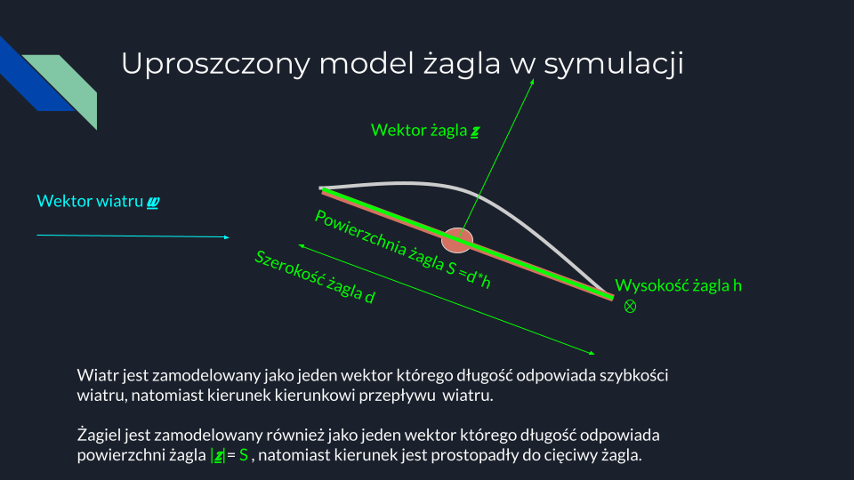
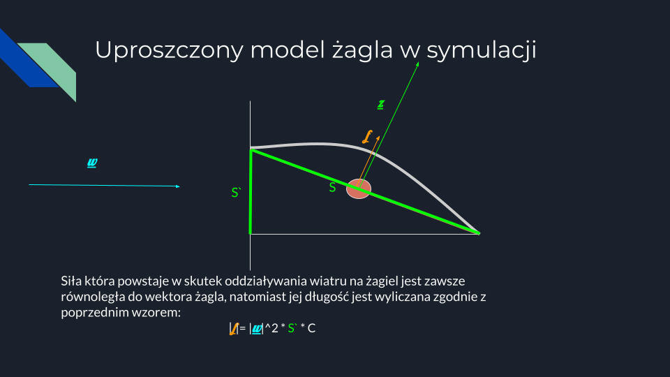
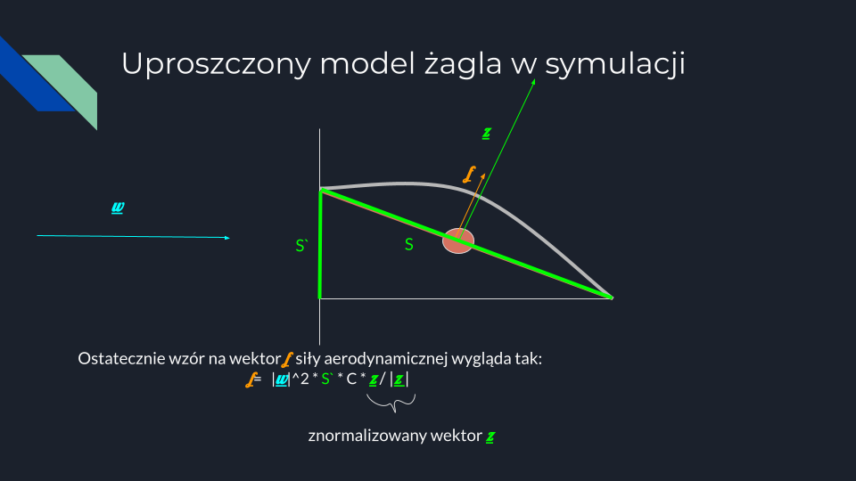
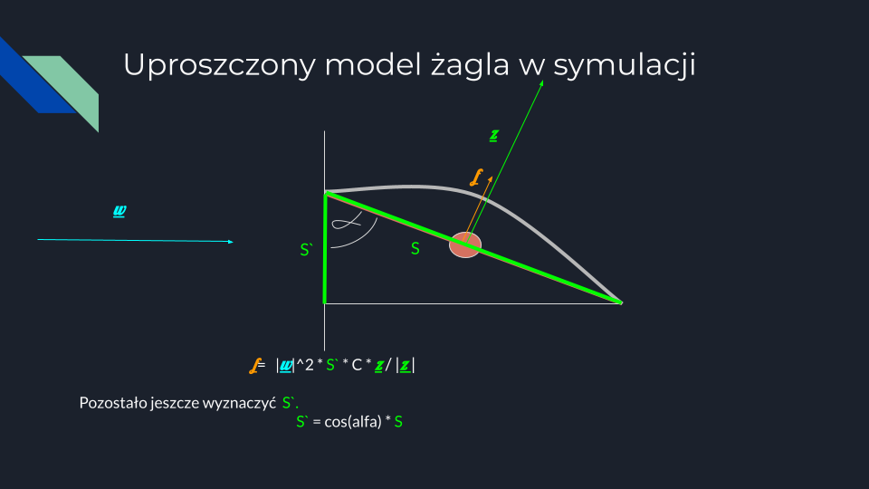
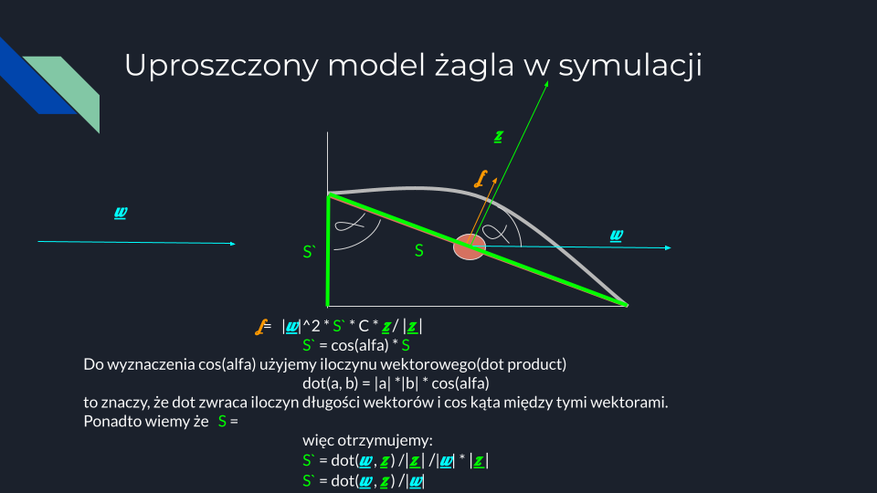
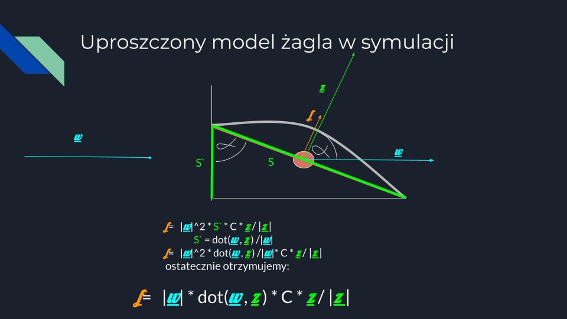

# Elementy świata

## świat

`Elementy świata` posiadają referencje do innych elementów świata. Tworzą w ten sposób strukturę danych (świat).
Tak wygląda diagram klas Elementów świata:


<!-- Diagram Klas nie dostarcza wystarczającej wiedzy, aby zrozumieć działanie symulatora. Należało by spojrzeć również na diagram obiektów, chociażby w stanie początkowym symulatora:
```
daigram obiektów
``` -->

Ogólnym założeniem jest stworzenie symulacji w której model fizyczny jest zbudowany z molekułów, które są związana oddziaływaniami ([Soft-body dynamics](https://en.wikipedia.org/wiki/Soft-body_dynamics)). Dzięki temu elementy statku będą mogły bardziej realistycznie się zachowywać np.żagiel wyginać przy silnym wietrze .   


### Wybrane Elementy świata

#### Position
```ts
export class Position {
    value: Vector2 = new Vector2(0, 0);
    constructor(value: Vector2 = new Vector2(0, 0)) {
    this.value = value;
    }
}
```
Pozycja jest tylko daną, nie posiada metod.

#### ViewPoint
```ts
export class ViewPoint implements View {
    readonly position: Position;
    readonly circle: THREE.Mesh;

    constructor(position: Position) {
        this.position = position;

        const geometry = new THREE.CircleGeometry(5, 32);
        const material = new THREE.MeshBasicMaterial({ color: 0xffff00 });
        this.circle = new THREE.Mesh(geometry, material);
        views.addView(this)
    }


    get3DObject(): THREE.Object3D<THREE.Event> {
        return this.circle;
    }
    update(): void {
        this.circle.position.set(this.position.value.x, this.position.value.y, 0);
    }
    destroy(): void {
        views.removeView(this);
    }
}
```

Ten element przechowuje informacje potrzebne do renderowania obiektu na ekranie. `update` 'tłumaczy' z pozycję elementu zapisanego w formie wykorzystywanej prze inne elementy tego systemu do zrozumiałej przez `Three.js`.   


#### DynamicElement
```ts
export class DynamicElement {
    force = new Vector2(0, 0);
    mass = 1;
    acceleration = new Vector2(0, 0);
    velocity = new Vector2(0, 0);
    position: Position

    viewPoint: ViewPoint // na potrzeby testów

    constructor(position: Position, mass: number = 1) {
        this.mass = mass;
        this.position = position;

        this.viewPoint = new ViewPoint(position);

        dynamicElements.addElement(this);
    }

    update(dt: number) {
        this.acceleration = this.force.clone().divideScalar(this.mass);
        this.velocity.add(this.acceleration.clone().multiplyScalar(dt));
        this.position.value.add(this.velocity.clone().multiplyScalar(dt));

        this.force = new Vector2(0, 0);
    }

    remove() {
        dynamicElements.removeElement(this);
    }

    getMomentum() {
        return this.velocity.clone().multiplyScalar(this.mass);
    }
}
```

Jest to jeden z ważniejszych elementów świata. Przechowuje on informacje o prędkości, przyspieszeniu, masie, pędzie i sile, która działa na element. metoda `update` dokonuje [integracji numerycznej](https://en.wikipedia.org/wiki/Numerical_integration#Reasons_for_numerical_integration) [równań ruchu](https://en.wikipedia.org/wiki/Equations_of_motion) W ten sposób oblicza nowe wartości swoich atrybutów. Ten Obiekt nie implementuje `WorldElements` ponieważ korzysta ze zmodyfikowanej metody `update` która przyjmuje argument `dt` (delta time) czyli zmiana jaka będzie użyta w integracji.
Należy uważać na prawidłową wartość `dt`. Zbyt mała może spowodować problemy z wydajnością, a zbyt duża może spowodować destabilizacje modelu dynamicznego tzn. model przestanie zachowywać stałe ruchu takie jak: zachowanie pędu, czy energii w skutek czego model się 'rozpadnie'.

##### Stabilność modelu dynamiki

Model jest stabilny, jeżeli zachowuje pęd

Pęd jest stały, jeżeli `dt` jest dostatecznie małe. Istnieje takie `dtMax` poniżej, którego system jest stabilny.  Jak podaje Wikipedia `dtMax` jest związane z największą częstością drgania któregokolwiek molekuła systemu. [Energy Drift](https://en.wikipedia.org/wiki/Energy_drift)

```
dtMax = 2^(1/2)/omega
```


Omega jest stała, jeżeli oddziaływania się nie zmieniają, to znaczy nie powstają i nie znikają nowe obiekty klasy `Interaction`. Omega jest równa 
```
omega = (k/m)^(1/2)
```
gdzie:
+ `k` - współczynnik sprężystości
+ `m` - masa

Dla cząstek, które podlegają wielu oddziaływaniom, zsumuję współczynnik sprężystości, tak jak by sprężyny były połączone równolegle.

Teraz znajduję największą omegę i na jej podstawie wyznaczam `dtMax` poniżej której system jest stabilny. 
Ciekawe 🤔, że to działa:

```ts
test('momentum conservation for for wsp = 2^(1/2)', () => {
        // molecular model is stable (conservation of momentum) if dt< wsp /omegaMax
        // where omegaMax is the highest oscilation frequency of the molecul in the system 
        // according to Wikipedia wsp should be 2^(1/2)
        dynamicElement1.velocity = new Vector2(10, 0);
        dynamicElement2.mass = 10000000;
        
        for (let i = 1; i < 1000; i++) {
            interaction.springRate = Math.random() * 1000;
            dynamicElement1.mass = Math.random() * 1000;
            dynamicElement2.mass = Math.random() * 1000;
            dynamicElement1.velocity = new Vector2(10, Math.random() * 1000);
            let maximumDt = calculatemaximumDt(interaction.springRate, dynamicElement1.mass, dynamicElement2.mass);
            maximumDt *= 1;
            let momentum0 = dynamicElement1.getMomentum().add(dynamicElement2.getMomentum());
            for (let i = 0; i < 10000; i++) {
                interaction.update();
                dynamicElementUpdater.update(maximumDt);
            }
            let momentum1 = dynamicElement1.getMomentum().add(dynamicElement2.getMomentum());
            expect(momentum0.distanceTo(momentum1) <= 0.01 * momentum0.length()).toBeTruthy();
        }
    });
```
Jeżeli `maximumDt` pomnożę, chociaż przez `1.1` to system przestaje być stabilny. 👏

#### Połączenie `DynamicElement`+ `Position`+ `ViewPoint`

Jeżeli połączę te trzy elementy otrzymam obiekt który może przesuwać się (być przesuwany?) po ekranie.

```ts
...
const position = new Position(new Vector2(0, 0));
const dynamicElement = new DynamicElement(position);
const viewPoint = new ViewPoint(position);
dynamicElement.velocity = new Vector2(1, 0);
...
```
```
gif
```
Obiekt `position` jest jak komunikator który umożliwia współprace pomiędzy `dynamicElement`(nadpisuje `position`), a viewPoint(wyświetla na podstawie `position`).

#### SpringInteraction

obiekty klasy `SpringInteraction` odpowiadają za powstawanie sił pomiędzy elementami dynamicznymi. Ten element świata implementuje model sprężyny i tłumika([Mass-spring-damper model](https://en.wikipedia.org/wiki/Mass-spring-damper_model)). 
##### Sprężyna
Sprężyna jest modelowana zgodnie z [prawem Hooke'a](https://en.wikipedia.org/wiki/Hooke%27s_law). Siła sprężystości jest proporcjonalna do odległości od punktu równowagi. 

##### Tłumik
Bez tłumienia obiekty drgały by bez przerwy co nie odzwierciedlało by dobrze rzeczywistość. Tłumik generuje [siłę tarcia](https://en.wikipedia.org/wiki/Friction) stała co do długości. Siła działa tylko wzdłuż tłumika i jest odwrotnie skierowana jak ruch tłumika.

##### Implementacja:
```ts
export class SpringInteraction implements WorldElement {
    readonly dynamicElement0: DynamicElement;
    readonly dynamicElement1: DynamicElement;
    private distance: number;
    springRate: number;
    readonly dumperRate: number;

    // readonly viewLine: ViewLine;

    constructor(dynamicElement0: DynamicElement, dynamicElement1: DynamicElement, springRate?: number, dumperRate?: number, distance?: number) {
        this.dynamicElement0 = dynamicElement0;
        this.dynamicElement1 = dynamicElement1;
        this.springRate = springRate ? springRate : calculateMaxSpringRate(Math.min(dynamicElement0.mass, dynamicElement0.mass), 1);
        this.dumperRate = dumperRate != undefined ? dumperRate : 0.1;
        this.distance = distance != undefined ? distance : dynamicElement0.position.value.distanceTo(dynamicElement1.position.value);
        springInteractions.addElement(this);
    }

    update(): void {
        const pointsShift = this.dynamicElement1.position.value.clone().sub(this.dynamicElement0.position.value);
        const pointDirection = pointsShift.clone().normalize();

        const springForceOn1 = calculateSpringForceOn1(pointsShift, pointDirection, this.springRate, this.distance);
        // according to third law of Newton
        const springForceOn2 = springForceOn1.clone().multiplyScalar(-1);

        const velocityShift = this.dynamicElement1.velocity.clone().sub(this.dynamicElement0.velocity);
        const dumperForceOn1 = calculateDumperForceOn1(velocityShift, this.dumperRate, pointDirection);
        const dumperForceOn2 = dumperForceOn1.clone().multiplyScalar(-1);

        this.dynamicElement0.force.add(springForceOn1);
        this.dynamicElement1.force.add(springForceOn2);
        this.dynamicElement0.force.add(dumperForceOn1);
        this.dynamicElement1.force.add(dumperForceOn2);
    }

    ...
}

function calculateSpringForceOn1(pointsShift: Vector2, pointDirection: Vector2, springRate: number, distance: number) {
    // acording to third law of Newton and spring force
    // F1 = -F2
    // F1 = -k * (x1 - x2)    
    const springNeutral = pointDirection.clone().multiplyScalar(distance);
    const springShift = pointsShift.clone().sub(springNeutral);
    const forceOn1 = springShift.clone().multiplyScalar(springRate);
    return forceOn1;
}
function calculateDumperForceOn1(velocityShift: Vector2, dumperRate: number, pointDirection: Vector2) {
    const velocityShiftPointDirection = pointDirection.clone().multiplyScalar(velocityShift.dot(pointDirection));
    const dumperForceOn1 = velocityShiftPointDirection.clone().multiplyScalar(dumperRate);
    return dumperForceOn1;
}
```

#### Dodanie Elementu springInteraction do świata

Dodanie do świata elementu `SpringInteraction` Sprawia że elementy `DynamicElement` otrzymują wartość siły która na nie działą i z tego mogą wyznaczyć przyspieszenie.
```ts
const position1 = new Position(new Vector2(0, 0));
const dynamicElement1 = new DynamicElement(position1);
const viewPoint1 = new ViewPoint(position);
dynamicElement1.velocity = new Vector2(1, 0);

const position2 = new Position(new Vector2(100, 0));
const dynamicElement2 = new DynamicElement(position2);
const viewPoint2 = new ViewPoint(position2);

const springInteraction = new SpringInteraction(dynamicElement1, dynamicElement2);
```
```
gif
```
Taka konstrukcja sprawi że obiekty będą poruszać się ruchem harmonicznym tłumionym wzdłuż osi x.

Właśnie te oddziaływania definiują jakie może być maksymalne `dt` aby model się nie rozpadł o czym już [wspomniałem](#stabilność-modelu-dynamiki).


#### PositionRotation
Obiekt, który służy do przechowywania informacji o położeniu i rotacji obiektu(bryły)
Skąd się bierze rotacja? o tym za chwilę
```ts
export class PositionRotation {
    readonly position: Position = new Position();
    rotation: Rotation = new Rotation();

    constructor(position?: Position, rotation?: Rotation) {
        this.position = position || new Position();
        this.rotation = rotation || new Rotation();
    }
};

export class Rotation {
    value: number = 0;

    constructor(value?: number) {
        this.value = value || 0;
    }
}
```

#### ViewTexture
Element świata podobny do `ViewPoint` ale zamiast kółka służy do wyświetlania tekstury. Do tego celu potrzebuje informacji o rotacji obiektu. 
```ts
export class ViewTexture implements View {
    readonly mesh: THREE.Mesh;
    readonly positionRotation: PositionRotation | (() => PositionRotation);
    readonly order: number = 0;
    rotationOffset: number = 0;
    positionOffset: THREE.Vector2 = new THREE.Vector2();
    newSkaleOnUpdate: () => { x: number; y: number; } = () => { return { x: 1, y: 1 } };
    size: { width: number, height: number } = { width: 0, height: 0 };

    constructor(positionRotation: PositionRotation | (() => PositionRotation), picturePath: string, size: { width: number, height: number }, order: number, repeat?: { x: number, y: number },) {
        this.order = order || -1;
        this.positionRotation = positionRotation;
        this.size = size;

        // clone texture beter (to not have a seam)
        const texture = new THREE.TextureLoader().load(picturePath);

        const setRepeat = (repeat: { x: number, y: number }, texture: THREE.Texture) => {
            texture.wrapS = THREE.MirroredRepeatWrapping;
            texture.wrapT = THREE.MirroredRepeatWrapping;
            texture.repeat.set(repeat.x, repeat.y);
        }
        repeat && setRepeat(repeat, texture);

        //create plane
        const geometry = new THREE.PlaneGeometry(size.width, size.height);
        const material = new THREE.MeshBasicMaterial({
            map: texture,
            transparent: true,
            // depthWrite: false,
            side: THREE.DoubleSide
        });

        this.mesh = new THREE.Mesh(geometry, material);

        //register view for rendering
        views.addView(this)

    }

    update() {

        const scale = this.newSkaleOnUpdate();
        this.mesh.scale.set(scale.x, scale.y, 1);

        const halfHeight = this.size.height / 4;
        const xOffset = -(halfHeight * scale.y - halfHeight);


        const vec = this.positionOffset.clone();
        vec.add(new THREE.Vector2(xOffset, 0));
        const positionRotation = this.positionRotation instanceof Function ? this.positionRotation() : this.positionRotation;
        vec.rotateAround(new THREE.Vector2(0, 0), positionRotation.rotation.value);
        const position = positionRotation.position.value.clone().add(vec);
        this.mesh.position.set(position.x, position.y, this.order);
        this.mesh.rotation.z = positionRotation.rotation.value + this.rotationOffset;
    }
    ...
}
```
Do konstruktora mogę przesłać referencję na obiekt `PositionRotation`, albo funkcję która to zwróci jest to wygodne bo daję swobodę co do sposobu wyliczenia rotacji bryły.

Metoda `onScaleUpdate` jest wykorzystywana np. do imitowania rozciągania żagli w zależności od prędkości wiatru.  

#### Triangel

Jest to element świata, który służy do wyliczania rotacji i pozycji bryły stworzonej z trzech 
`DynamicElenent` połączonych ze sobą za pomocą `SpringInteraction`. Chociaż sam model fizyki nie posiada przestrzeni rotacji (nie ma takich elementów jak moment bezwładności, czy moment siły),
to rotacja jest symulowana. Jest wynikiem oddziaływań powstałych przez `SpringInteraction`. Rotacja jest wyliczana na podstawie zmiany położenia trzech obiektów `DynamicElement` względem siebie. 

```ts
export class Triangle implements WorldElement {
    readonly position0: Position;
    readonly position1: Position;
    readonly position2: Position;
    readonly positionRotation: PositionRotation;

    constructor(position0: Position, position1: Position, position2: Position, positionRotation: PositionRotation) {
        this.position0 = position0;
        this.position1 = position1;
        this.position2 = position2;
        this.positionRotation = positionRotation;
        triangles.addElement(this)
    }
     update(): void {
        const positionRotation = this.getPositionRotation();
        this.positionRotation.position.value = positionRotation.position.value;
        this.positionRotation.rotation = positionRotation.rotation;
    }
    private getPositionRotation(): PositionRotation {
        const botomEdge = this.position0.value.clone().sub(this.position1.value);
        const ortoganalToBotomEdge = new Vector2(-botomEdge.y, botomEdge.x); // rotate 90 degrees, GPT proposition
        const rotationOfTriangle = Math.atan2(ortoganalToBotomEdge.y, ortoganalToBotomEdge.x);

        const centerOfTriangle = this.position0.value.clone().add(this.position1.value).add(this.position2.value).divideScalar(3); // GPT proposition

        const positionRotation = new PositionRotation(new Position(centerOfTriangle), new Rotation(rotationOfTriangle));
        return positionRotation;
    }
    ...
}
``` 

W ten sposób uzyskuję rotacje potrzebną do wyświetlenia tekstury.
##### Przykład
```ts
const position0 = new Position(new Vector2(0, 0));
const position1 = new Position(new Vector2(0, 100));
const position2 = new Position(new Vector2(100, 0));

const dynamicElement0 = new DynamicElement(position0);
const dynamicElement1 = new DynamicElement(position1);
const dynamicElement2 = new DynamicElement(position2);

const springInteraction0 = new SpringInteraction(dynamicElement0, dynamicElement1);
const springInteraction1 = new SpringInteraction(dynamicElement1, dynamicElement2);
const springInteraction2 = new SpringInteraction(dynamicElement2, dynamicElement0);

const positionRotation = new PositionRotation();

const triangle = new Triangle(position0, position1, position2, positionRotation);

const texture = new ViewTexture(positionRotation, "assets/ship.png", { width: 100, height: 100 }, 0, { x: 1, y: 1 });

//dodanie prędkości
dynamicElement0.velocity.value = new Vector2(100, 0);
```
Taka konfiguracja spowoduje wyświetlenia na ekranie poruszającego się w prawo i obracającego się zgodnie z ruchem wskazówek zegara tekstury "assets/ship.png".

#### FluidInteractor

Element świata, który symuluję mechanikę płynów. Jest to element, który sprawia że żagle i ster generują siłę napędową.

Poniższe grafiki prezentują koncepcje wyliczania siły napędowej w symulacji:








Implementacja:
```ts
export class FluidInteractor implements WorldElement {
    getNormal: () => Vector2
    dynamicElement: DynamicElement;
    fluid: Fluid;
    getArea: () => number;
    actualForce: Vector2 = new Vector2();

    constructor(fluid: Fluid, normalGetter: () => Vector2, areaGetter: () => number, dynamicElement: DynamicElement) {

        this.fluid = fluid;
        this.getNormal = normalGetter;
        this.getArea = areaGetter;
        this.dynamicElement = dynamicElement;
        fluidInteractors.addElement(this);
    }

    update(): void {
        const maxFluidForce = 10000;
        const velocity = this.fluid.velocity.clone().sub(this.dynamicElement.velocity);

        const dotNormalVelocity = velocity.dot(this.getNormal());
        const dotNormalVelocitySquared = dotNormalVelocity * dotNormalVelocity * (dotNormalVelocity > 0 ? 1 : -1);
        const forceLength = dotNormalVelocitySquared * this.fluid.density * this.getArea();
        const safeFluidForceLength = Math.min(Math.abs(forceLength), maxFluidForce) * (forceLength > 0 ? 1 : -1);

        const fluidForce: Vector2 = this.getNormal().clone().multiplyScalar(safeFluidForceLength);

        this.actualForce.set(fluidForce.x, fluidForce.y);
        this.dynamicElement.force.add(fluidForce);
    }
    destroy(): void {
        throw new Error("Method not implemented.");
    }

}
```

W systemie Istnieją dwa rodzaje płynów: `Wind` i `Water`.
```ts
   export class Fluid implements WorldElement {
    density: number;
    velocity: Vector2;

    constructor(density: number, velocity: Vector2) {
        this.density = density;
        this.velocity = velocity;
    }

    update(): void { // na razie nie mam potrzeby aktualizowania płynów, np kierunku wiatru
        throw new Error("Method not implemented.");
    }
    ...
}
    export const wind = new Fluid(1, new Vector2(0, 1));

    const water = new Fluid(1000, new Vector2(0, 0));
```
Woda jest 100 razy gęstsza od powietrza, dlatego też siła napędowa generowana przez wiatr jest 100 razy mniejsza niż siła napędowa generowana przez wodę przy takich samych pozostałych parametrach.

#### Ship
Z powyższych elementów bazowych mam dużą swobodę w konstruowaniu różnych obiektów pływających. Oto implementacja statku występującego w aktualnej wersji symulacji:
```ts
export class Ship2 {
    positionRotation = new PositionRotation();
    triangle: Triangle;
    hull = new Hull2();

    sail1: Sail
    sail2: Sail

    sword: Ster;

    ster: Ster;

    ropes: Rope[] = []; // liny służą do obracania żagli

    userInteractor: UserInteractor;

    constructor() {
        const centerY = this.hull.dynamicCollidingPolygon.centerDynamicElement.position.value.y;


        this.sail1 = new Sail(new Vector2(200, centerY));
        this.sail2 = new Sail(new Vector2(500, centerY));

        this.hull.dynamicCollidingPolygon.connectDynamicElement(this.sail1.mast);
        this.hull.dynamicCollidingPolygon.connectDynamicElement(this.sail2.mast);

        const ropeLeftSail1 = new SpringInteraction(this.sail1.yardLeft, this.sail2.mast, 0.1, 0.1);
        const ropeRightSail1 = new SpringInteraction(this.sail1.yardRight, this.sail2.mast, 0.1, 0.1);
        const ropeLeftSail2 = new SpringInteraction(this.sail2.yardLeft, this.sail1.mast, 0.1, 0.1);
        const ropeRightSail2 = new SpringInteraction(this.sail2.yardRight, this.sail1.mast, 0.1, 0.1);

        this.ropes.push({ side: 'left', sail: 'front', interaction: ropeLeftSail1 });
        this.ropes.push({ side: 'right', sail: 'front', interaction: ropeRightSail1 });
        this.ropes.push({ side: 'left', sail: 'back', interaction: ropeLeftSail2 });
        this.ropes.push({ side: 'right', sail: 'back', interaction: ropeRightSail2 });

        this.triangle = new Triangle(this.sail1.mast.position, this.sail2.mast.position, this.hull.shapeOfFirstHalfOfShip[5], this.positionRotation);


        this.ster = new Ster(new Position(new Vector2(60, centerY)), this.triangle);
        this.hull.dynamicCollidingPolygon.connectDynamicElement(this.ster.dynamicElement);
        this.ster.rotationOfSter.value = Math.PI / 8;

        this.sword = new Ster(new Position(new Vector2(350, centerY)), this.triangle);
        this.hull.dynamicCollidingPolygon.connectDynamicElement(this.sword.dynamicElement);

        this.userInteractor = new UserInteractor(this.hull.dynamicCollidingPolygon.collidingPolygon);
        ...
    }
    ...
}
```

Najważniejsze Elementy Statku to:
+ kadłub - `Hull2`-> Łączy ze dobą wszystkie elementy statku
+ żagle - `Sail` -> produkują się napęd, którą przekazuja do kadłuba po prze `SpringInteraction`. Połączone są z kadłubem w trzech punktach: `mast`, `yardLeft`, `yardRight`, liny (`SpirngInteraction`) zmieniają swoją długość i w ten sposób obracają żagle.
+ sword - `Ster` -> obiekt który jest 'przypięty' do kadłuba na środku i oddziałuje z wodą, nie może się obracać.
+ ster - `Ster` -> obiekt który jest 'przypięty' do kadłuba z tyłu i może się obracać.  

##### Kadłub
Łączy ze sobą wszystkie elementy statku
```ts
export class Hull2 {

    dynamicCollidingPolygon: DynamicCollidingPolygon;
    shapeOfFirstHalfOfShip: Position[];
    shapeOfSecondHalfOfShip: Position[];
    viewTexture: ViewTexture;
    triangle: Triangle;
    positionRotation = new PositionRotation();
    fluidInteractor: FluidInteractor;
    constructor(location?: Vector2) {
        this.shapeOfFirstHalfOfShip = [
            new Position(new Vector2(17, 176)),
            new Position(new Vector2(208, 205)),
            new Position(new Vector2(362, 218)),
            new Position(new Vector2(539, 210)),
            new Position(new Vector2(606, 195)),
            new Position(new Vector2(650, 167)),
            new Position(new Vector2(672, 127)),
        ];

        this.shapeOfSecondHalfOfShip = this.shapeOfFirstHalfOfShip.map((position) => {
            return new Position(new Vector2(position.value.x, -position.value.y + 220));
        });

        const reverserSecondhalf = this.shapeOfSecondHalfOfShip.slice().reverse();
        const shapeOfShip = this.shapeOfFirstHalfOfShip.concat(reverserSecondhalf);

        this.dynamicCollidingPolygon = new DynamicCollidingPolygon(shapeOfShip, 1000);

        this.triangle = new Triangle(this.shapeOfSecondHalfOfShip[0], this.shapeOfFirstHalfOfShip[0], this.dynamicCollidingPolygon.centerDynamicElement.position, this.positionRotation);

        this.viewTexture = new ViewTexture(this.positionRotation, 'kadlub.png', { width: 680, height: 220 }, 1);
        this.viewTexture.positionOffset = new Vector2(190, 0);

        this.fluidInteractor = WaterInteractor(
            () => {
                const normal = this.triangle.getNormal();
                return normal;
            },
            () => 0.00001,
            this.dynamicCollidingPolygon.centerDynamicElement
        )
    }
}
```
`DynamicCollidingPolygon` to klasa która generuje bryłę z podanych punktów, po przez związanie ich za pomocą  `SpringInteraction`. Ponadto obiekt ten potrafi kolidować z innymi, niestety funkcjonalność ta została wyłączona ponieważ nie jest zbyt wydajna. Znajduje się tutaj już obiekt definiujący wygląd - zwykła przyklejona tekstura. Model kadłuba realizuje [soft body dynammics](https://en.wikipedia.org/wiki/Soft-body_dynamics), czyli jest elastyczny. Jadnak z braku czasu nie zaimplementowałem takiego wyglądu.

##### Żagiel
```ts
class Sail {
    yardView: ViewTexture;
    sailView: ViewTexture;
    positionRotation: PositionRotation;
    triangle: Triangle;

    mast: DynamicElement;
    yardLeft: DynamicElement;
    yardRight: DynamicElement;
    aditionalDynamicElement: DynamicElement;

    interactions: SpringInteraction[] = [];

    windInteractor: FluidInteractor
    // dynamicTriangle: DynamicTriangle;
    sailArea = 1;
    unfurling = 1;

    constructor(position: Vector2) {
        const width = 400;
        const height = 50;
        this.mast = new DynamicElement(new Position(position));
        this.yardLeft = new DynamicElement(new Position(new Vector2(0, width / 2).add(position)));
        this.yardRight = new DynamicElement(new Position(new Vector2(0, -width / 2).add(position)));

        this.aditionalDynamicElement = new DynamicElement(new Position(new Vector2(-height, 0).add(position)));

        this.interactions.push(new SpringInteraction(this.mast, this.yardLeft, 0.1, 0.1));
        this.interactions.push(new SpringInteraction(this.mast, this.yardRight, 0.1, 0.1));
        this.interactions.push(new SpringInteraction(this.yardLeft, this.aditionalDynamicElement, 0.1, 0.1));
        this.interactions.push(new SpringInteraction(this.yardRight, this.aditionalDynamicElement, 0.1, 0.1));
        this.interactions.push(new SpringInteraction(this.mast, this.aditionalDynamicElement, 0.1, 0.1));

        const getNormal = () => {
            const vectorYard = this.yardLeft.position.value.clone().sub(this.yardRight.position.value);
            const yardPerpendicular = new Vector2(-vectorYard.y, vectorYard.x);
            yardPerpendicular.normalize();
            return yardPerpendicular;
        }
        this.windInteractor = WindInteractor(() => getNormal(), () => this.sailArea * this.unfurling, this.mast);


        this.positionRotation = new PositionRotation();
        this.triangle = new Triangle(this.yardLeft.position, this.yardRight.position, this.aditionalDynamicElement.position, this.positionRotation);

        this.yardView = new ViewTexture(this.positionRotation, 'yard.png', { height, width }, 1);
        this.yardView.rotationOffset = Math.PI / 2;
        this.yardView.positionOffset = new Vector2(-height / 2, 0);


        this.sailView = new ViewTexture(this.positionRotation, 'plutno.png', { height, width }, 3);
        this.sailView.rotationOffset = Math.PI / 2;
        this.sailView.positionOffset = new Vector2(-height / 2, 0);

        const windForce = this.windInteractor.actualForce

        this.sailView.newSkaleOnUpdate = () => {
            return { x: 1, y: Math.cbrt((-windForce.clone().dot(getNormal()) * 50)) }
        };
    }
     changeSailArea(changeUnfurling: number) {
        this.unfurling += changeUnfurling;
        this.unfurling = Math.min(Math.max(this.unfurling, 0), 1);

        this.sailView.newSkaleOnUpdate = () => {
            return { x: this.unfurling, y: Math.cbrt((-this.windInteractor.actualForce.clone().dot(this.triangle.getNormal()) * 50)) }
        };
    }
}
```
Sam żagiel jest bryłą zbudowaną z czterech `DynamicElement` i `SpringInteraction` pomiędzy nimi. Do masztu jest doczepiony `FluidInteractor`. Tekstura żagla jest skalowana w zależności od siły która na niego działa. Żagiel może być zwijany i rozwijany.

##### Ster
```ts
class Ster {
    dynamicElement: DynamicElement;
    fluidInteractor: FluidInteractor;
    triangleOfShip: Triangle;
    rotationOfSter: Rotation = new Rotation();
    area = 0.01;
    view: ViewTexture;
    constructor(position: Position, triangleOfShip: Triangle) {
        this.triangleOfShip = triangleOfShip;
        const positionRotation = triangleOfShip.positionRotation;
        this.dynamicElement = new DynamicElement(position);

        const getNormal = () => {
            const shipNormal = this.triangleOfShip.getNormal();
            const rotatedNormal = shipNormal.clone().rotateAround(new Vector2(), this.rotationOfSter.value);
            return rotatedNormal;
        }

        this.fluidInteractor = WaterInteractor(() => getNormal(), () => this.area, this.dynamicElement);

        const getPositionRotation = () => {
            const rotation = new Rotation(this.triangleOfShip.positionRotation.rotation.value);
            rotation.value += this.rotationOfSter.value + Math.PI / 2;
            const position = this.dynamicElement.position;
            return new PositionRotation(position, rotation);
        }

        this.view = new ViewTexture(getPositionRotation, 'ster.png', { width: 50, height: 10 }, 1);
    }
}
```
Ster Jest prostszy od żagla. Nie jest bryłą, składa sią z tylko jednego `DynamicElement`. Do niego jest doczepiony `FluidInteractor`. Ster może być obracany. Rotacja steru w przestrzeni świata jest wyliczana na podstawie rotacji statku i rotacji steru względem statku.

#### Collisions

System Posiada zaimplementowany model kolizji, jednakże nie spełnia wymagań wydajności, więc nie będą go omawiał.


